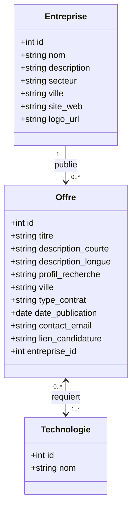
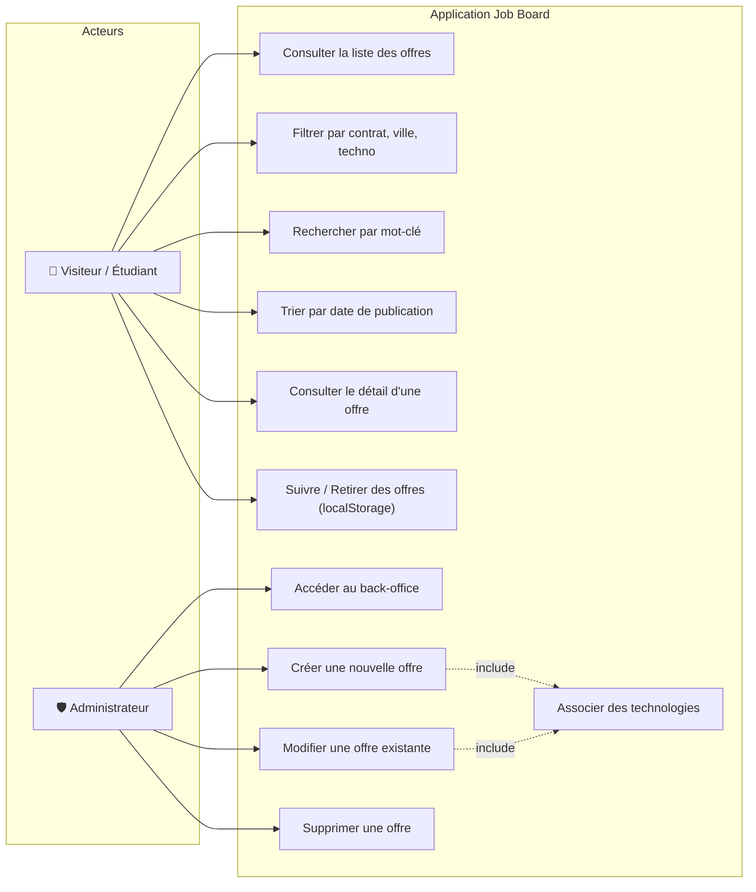
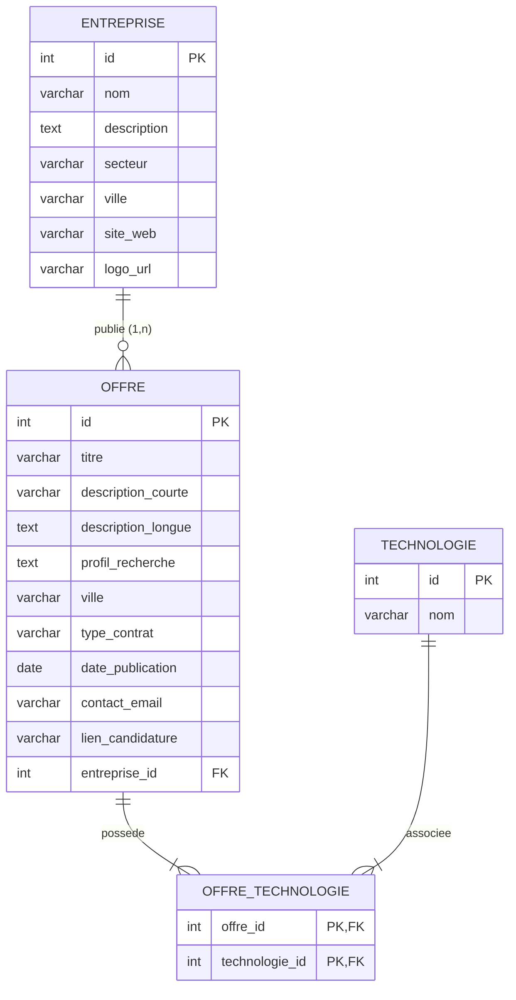
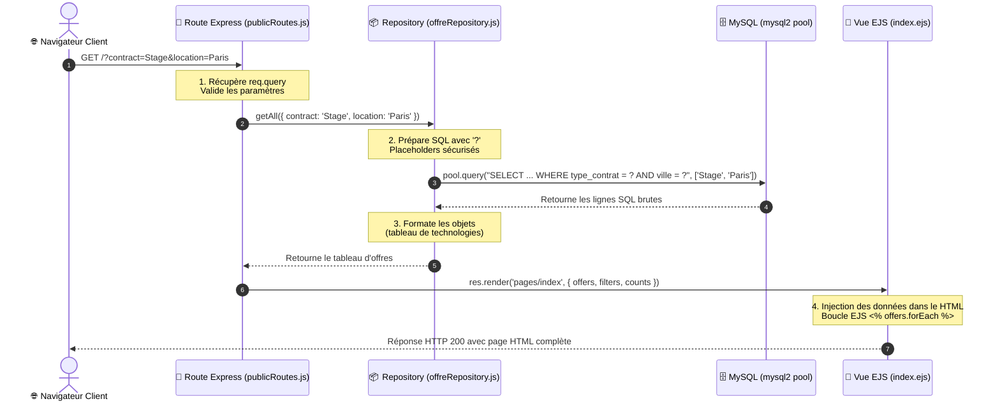
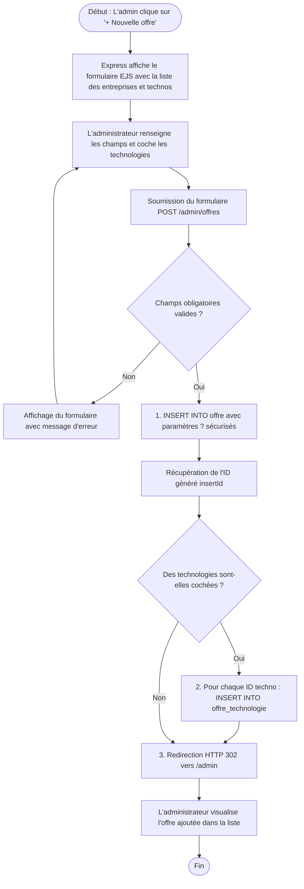

# Documentation Technique & Diagrammes - Job Board Full-Stack

Ce dossier rassemble l'ensemble des diagrammes de conception exigés par le référentiel et le cahier des charges du projet.

---

## 1. Diagramme de Classes UML (Domaine Métier)

Ce diagramme modélise les entités principales de l'application, leurs attributs et leurs relations :
- Une **Entreprise** peut publier plusieurs **Offres** (1 à N).
- Une **Offre** est rattachée à une seule **Entreprise** (1 à 1).
- Une **Offre** requiert plusieurs **Technologies** et une **Technologie** peut être demandée par plusieurs **Offres** (N à N).

---

## 2. Diagramme de Cas d'Utilisation (Use Cases)

Identifie les interactions entre les utilisateurs du système :
- **Visiteur / Étudiant** : Consultation, recherche, filtres (ville, contrat, techno), tri, gestion des favoris locaux.
- **Administrateur / Recruteur** : Gestion complète (CRUD) des offres et association des compétences techniques.

---

## 3. Modèle Relationnel Logique (MLD / LRM)

Traduction du diagramme de classes en schéma relationnel normalisé avec clés primaires (PK) et clés étrangères (FK) :

- **ENTREPRISE** (<ins>id</ins>, nom, description, secteur, ville, site_web, logo_url, created_at)
- **TECHNOLOGIE** (<ins>id</ins>, nom)
- **OFFRE** (<ins>id</ins>, titre, description_courte, description_longue, profil_recherche, ville, type_contrat, date_publication, contact_email, lien_candidature, #entreprise_id, created_at)
  - Clé étrangère : *entreprise_id* fait référence à *ENTREPRISE(id)* avec suppression en cascade (`ON DELETE CASCADE`).
- **OFFRE_TECHNOLOGIE** (<ins>#offre_id, #technologie_id</ins>)
  - Clé primaire composite : *(offre_id, technologie_id)*
  - Clé étrangère : *offre_id* fait référence à *OFFRE(id)* (`ON DELETE CASCADE`)
  - Clé étrangère : *technologie_id* fait référence à *TECHNOLOGIE(id)* (`ON DELETE CASCADE`)

---

## 4. Diagramme de Séquence (Flux Route Express -> Repository -> MySQL -> Vue EJS)

Ce diagramme illustre le flux complet d'une requête HTTP publique (ex: l'utilisateur filtre les offres sur la page d'accueil) :

---

## 5. Diagramme d'Activité (Création d'une Offre en Back-Office)

Illustre le cycle de vie de la soumission d'une offre depuis le formulaire administrateur jusqu'à la persistance en base :

